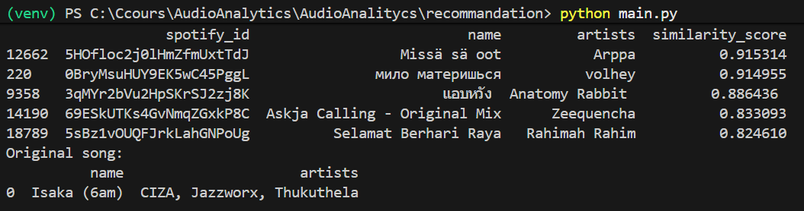

# AudioAnalitycs

## Project Setup

Due to the size of the multiple dataset, they have been stored out of the project on this link :
https://drive.google.com/drive/folders/1k-HPTUzPT_xZc8-DYe7EUWvLc5btsngj?usp=drive_link

When the different dataset are downloaded, put them in the folder "data" in the root of the project.

You then need to download the different depedencies of this projet with this following command :
```
pip install -r requirements.txt
```

Recommended: create a virtual environment
```
python -m venv venv
```

Activate:

Windows:
```
venv\Scripts\activate
```

## Predict the popularity of a spotify song

### How to use it

1. Load the dataset as explained in the Project Setup section.

2. To train the model, run estim_popularite_son.py. This will train the model and save it.

3. To evaluate the model, run load_model.py. This script displays the RMSE, R² score, and two graphs to assess the model’s accuracy and visualize the popularity distribution.

### How does it work

This feature aims to estimate the popularity score of a Spotify song (from 0 to 100) based on its metadata characteristics.
The prediction is performed using a machine learning regression model trained on historical Spotify chart data.

The prediction pipeline is composed of the following steps:

1. Data loading

    * The dataset is loaded using a dedicated EstimDataLoader class.

    * Text and numerical features are identified automatically.

2. Feature selection

    * Highly correlated or irrelevant features are removed based on a correlation matrix analysis.

    * This helps reduce noise and overfitting.

3. Preprocessing

    * Numerical features are scaled using StandardScaler.

    * Textual features are encoded using an ordinal encoding strategy.

    * All preprocessing steps are encapsulated in an object-oriented preprocessor class.

4. Model training

    * A Linear Regression model is used as a baseline.

    * The model learns a linear relationship between features and popularity.

5. Model persistence

    * The trained model can be saved and reloaded to avoid retraining.

    * This enables fast inference and reproducibility.


During the training phase, several feature selection steps were applied.
To limit the dimensionality of the dataset, multiple tests were conducted and only a subset of the most relevant features was kept for model training.

### Model evaluation

The model is evaluated using standard regression metrics:

* RMSE (Root Mean Squared Error) measures the average prediction error in popularity points.

* R² score indicates how much of the variance in popularity is explained by the model.

RMSE ≈ 14
and
R² ≈ 0.12

These results show that:

* The model captures general trends in popularity but cannot show precise prediction as it's RMSE is still quite wide when you look at the distribution of the popularity. (cf load_model.py second graph)

* Extreme popularity values are harder to predict due to dataset imbalance, a lot of the popularity range from 40 to 100 while a little minority are around 0 (cf load_model.py second graph)

### Limitation
The dataset used in this project is inherently biased, as it focuses exclusively on top-charting songs across different countries. As a result, it does not fully reflect the diversity and complexity of the music industry.
Key external factors such as media exposure, marketing strategies, social influence, and promotional campaigns are not present in the dataset, which limits the accuracy of the popularity predictions.

Moreover, the linear regression model used in this project is limited in its ability to model complex and non-linear relationships, which are likely to play a significant role in determining a song’s popularity.

## Music Recommendation

### Objective

Objective
Recommend musically similar tracks using Spotify audio features.
Since no user interaction data is available, collaborative filtering is not applicable.
A content-based filtering approach is implemented.

### DATASET 

universal_top_spotify_songs.csv

Audio features used:
- danceability
- energy
- loudness
- speechiness
- acousticness
- instrumentalness
- liveness
- valence
- tempo

### DATA Preprocessing

Implemented via SpotifyDataCleaner

Steps:
- Remove duplicates
- Handle missing values
- Normalize features using StandardScaler
- Normalization ensures balanced contribution across dimensions.

### Model Design

#### Content-Based Filtering with Cosine Similarity

Each song is represented as a feature vector.
Similarity between two songs:
cos(A, B) = (A · B) / (||A|| ||B||)

Why this approach?
- No user ratings available
- Suitable for standardized feature vectors
- Interpretable and efficient

### How Recommendation Works

- Load processed dataset
- Compute cosine similarity matrix
- Select target song
- Rank songs by similarity
- Return top-k recommendations with similarity scores

Example output:




### Evaluation Strategy

No ground truth labels are available.
Therefore, evaluation is based on internal coherence metrics.

Evaluation Protocol

- Randomly sample 20 songs
- Compute average similarity of top-5 recommendations
- Compare multiple feature sets

Tested configurations:
- All features
- Without loudness
- Without tempo
- Without instrumentalness
Results visualized in visualize_model.py

### Visualizations

- Correlation heatmap
- Feature impact comparison
- Similarity score distribution

These analyses justify model choices and validate performance.

### Future Improvements

Popularity Prediction:

- Nonlinear models (Random Forest, XGBoost)
- Feature engineering improvements

Recommendation System:

- Hybrid filtering
- Clustering-based genre grouping
- Interactive interface